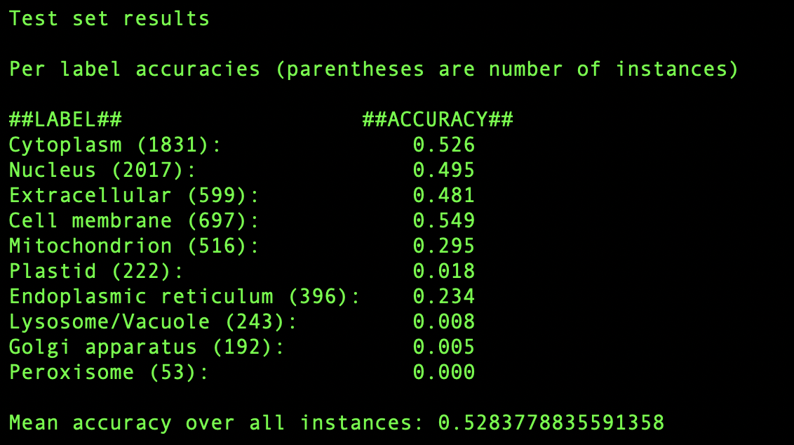

## Overview

The 'protein localization classifier' is a trigram based classifier which
takes an amino acid sequence as an input and predicts the localization of the
corresponding protein in the cell. Trigram classification is a known weak method,
but this project served as a valuable personal introduction to computational biology 
and will serve as a baseline against which future more powerful models can be measured.

The classifier uses ten separate amino acid-level trigram character models, 
each one trained on a localization-filtered subset of DeepLoc 2.0's protein
localization dataset. Thus there is one trigram model for each localization. Novel
sequences are then passed through each of the ten models, yielding ten different
negative log likelihoods. The lowest of these is selected by the classifier as the
predicted localization.

The trigram models were implemented as simple count matrices from which a 
probability matrix was calculated.

Four-fold ross validation yielded maximum dev accuracy when the count matrix was initialized
with model smoothing factor k=7. Further improvements could likely be made by having
multiple smoothing factors which are not uniform across the different trigram models.

## Results

Best average dev accuracy was 51.87%, and the test accuracy for the same hyperparameter was
52.84%. This is considerably worse than state of the art protein language models,
which score ~75–80% on this dataset. However, it is considerably better than 
random guessing (~10%) or other naive strategies like 'cytoplasm only' (~35%). A
suboptimal accuracy is also to be expected given that a trigram model is by nature
blind to large scale structure in the data.

`final_train_and_score.py` now outputs a confusion matrix (rows are ground truth
and columns are model prediction), as well as a row normalized confusion matrix.
The diagonal of this row-normalized confusion matrix is the per label model accuracy,
pictured below:

The smaller classes have much lower accuracy. This is probably because the smoothing factor
k=7 is applied uniformly to the count matrices, and for a very small class, the number
of real counts cannot compete with smoothing. In addition to this fact, smaller classes
will have inherently noisier trigram models, which will drive up their loss and bias the
entire model against them. Peroxisome in particular, which was barely represented in the test
set, was accurately guessed 0% of the time. Results could possibly be improved by having a
per-label smoothing factor proportional to the number of instances of that label.

The primary goals of this project were achieved: to work with a real biological
dataset, and to create a model which was more informative than a completely naive
approach.

## Data
Training data is the Swiss-Prot train/validation set from **DeepLoc 2.0**:
[services.healthtech.dtu.dk/services/DeepLoc-2.0](https://services.healthtech.dtu.dk/services/DeepLoc-2.0/)

Thumuluri V., Almagro Armenteros J.J., Johansen A.R., Nielsen H., Winther O.
(2022). DeepLoc 2.0: multi-label subcellular localization prediction using
protein language models. *Nucleic Acids Research*, 50(W1), W228–W234.
[doi.org/10.1093/nar/gkac278](https://doi.org/10.1093/nar/gkac278)

## How to run

First navigate to repo through CLI. Run `partition_data.py` to split the 
dataset into five separate, homology aware partitions.

Once the data is partitioned, run `cross_val.py` to have the system run cross
validation across a range of smoothing parameter k, using the all data partitions
except data4.csv for train/val rotations. To speed up tuning, start with a larger
increment in the main loop (one or greater; you will have to manually change this)
and then edit the loop parameters to be more finely resolved closer to previous
maximum. My experiments landed on an ideal smoothing hyperparameter k=7.0.

Once ideal hyperparameter is determined, enter this in the config section of
`final_train_and_score.py`, then run `final_train_and_score.py` to train the 
model on the first four train/dev partitions, and to score it on the final test
partition.

To have the model classify a given sequence, open `classifier.py` and enter
the sequence as a string on line 20. Delete the placeholder sequence first.
The saved model is whatever is last trained, so make sure that you have
run `final_train_and_score.py` before classification.

## AI Usage

I used Claude Code to upload the MIT license, for python syntax and biology reference (in particular for a pandas refresher), and as a general sanity check at the end. All code and design were my own in both concept and execution.
